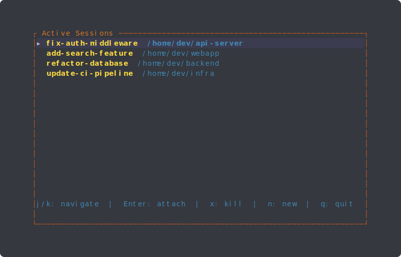
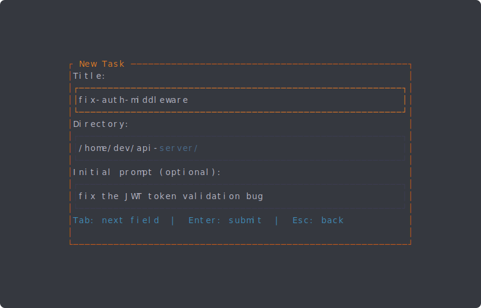

# Van Damme

A terminal UI (TUI) application for managing Claude Code sessions inside tmux. It provides a streamlined workflow for spinning up isolated Claude coding environments — each with its own git worktree, editor window, and Claude instance — and switching between them from a single dashboard.

## Screenshots

### Session List


### New Task Form


## What It Does

Van Damme acts as a session manager for Claude Code. When you launch it, you see a list of your active sessions. From there you can:

- **Create a new task** — Fill in a title, working directory, and optional initial prompt. Van Damme creates a tmux session with a `claude` window running `claude --worktree <name>` in the specified directory, giving Claude its own isolated git worktree. When Claude's `SessionStart` hook fires, a second `editor` window is automatically created with `vim .` and a horizontal split pane.

- **Live session state** — Each session shows a status icon updated in real-time via Claude Code hooks:
  - **⚙ Working** — Claude is processing a prompt
  - **⏳ Waiting User** — Claude is requesting permission
  - **● Idle** — Claude has stopped or is waiting for input

- **Attach to an existing session** — Select a session and press Enter to jump into the tmux session.

- **Kill a session** — Remove a session you no longer need. This kills the tmux session and cleans up the session record.

All session metadata (tmux IDs, directories, timestamps, state) is persisted to `~/.van-damme/sessions.json`, so the app remembers your sessions across restarts. On startup, it filters out any sessions whose tmux processes have since been terminated.

## How It Works

### Architecture

The application is structured into these modules:

| Module | Purpose |
|---|---|
| `main.rs` | Entry point. Routes `process-hook` subcommand or runs the TUI draw/event loop, dispatching between session list and new-task screens. |
| `app.rs` | The "New Task" form — a four-field input (title, directory, initial prompt, CLI args) with tab-completion on the directory field. Validates inputs and emits `Submit` actions. |
| `session_list.rs` | The "Active Sessions" screen — a navigable list of live sessions with state icons and vim-style keybindings (j/k, Enter, x, n, q). |
| `tmux.rs` | Tmux command wrappers: `create_session` (creates the Claude window), `setup_editor_window` (creates editor + split, triggered by hook), `kill_session`, session name sanitization, and shell escaping. |
| `session.rs` | JSON persistence layer. Stores `SessionRecord` entries (with `SessionState` tracking) to `~/.van-damme/sessions.json`. Provides lookup by claude session ID and state updates. |
| `process_hook.rs` | Claude Code hook handler. Reads hook event JSON from stdin, updates session state, and triggers editor window creation on `SessionStart`. |
| `event.rs` | Thin abstraction over crossterm's event polling with a configurable tick rate. |
| `tui.rs` | Terminal setup and teardown (raw mode, alternate screen). |
| `theme.rs` | Color palette constants (dark background with warm orange accents). |

### Screen Flow

```
┌──────────────────────────┐       'n'        ┌──────────────────┐
│   Active Sessions        │ ───────────────▸  │    New Task       │
│                          │                   │                   │
│  ▸ ⚙ task-one  /src     │    Esc (back)     │  Title: [       ] │
│    ● task-two  /api      │ ◂───────────────  │  Dir:   [       ] │
│    ⏳ task-three  /lib   │                   │  Prompt:[       ] │
│                          │                   │  Args:  [       ] │
│  j/k  Enter  x  q       │                   │  Tab  Enter  Esc  │
└──────────────────────────┘                   └──────────────────┘
         │ Enter                                   │ Enter
         ▼                                         ▼
   tmux attach -t <name>              tmux new-session + persist
```

### Hook-Driven Lifecycle

Van Damme integrates with Claude Code's hook system to track session state and manage tmux windows. When Claude emits lifecycle events, the `process-hook` subcommand updates the session database:

```
Claude Code                     Van Damme
    │                               │
    │── SessionStart ──────────────▸│ create editor window + split
    │── UserPromptSubmit ──────────▸│ state → ⚙ Working
    │── PermissionRequest ─────────▸│ state → ⏳ Waiting User
    │── Stop ──────────────────────▸│ state → ● Idle
    │                               │
```

This replaces the previous polling-based approach — the editor window is created exactly when Claude's session starts, and state updates are instant.

### Directory Autocomplete

The directory input field features filesystem tab-completion. As you type a path, it computes matching directories and displays ghost suggestions in blue. Press the right arrow key to accept a suggestion, or keep typing to narrow the matches. It uses longest-common-prefix logic when multiple directories match.

## Keybindings

### Session List

| Key | Action |
|---|---|
| `j` / `Down` | Move selection down |
| `k` / `Up` | Move selection up |
| `Enter` | Attach to selected session |
| `x` | Kill selected session |
| `n` | Create new task |
| `q` / `Esc` | Quit |

### New Task Form

| Key | Action |
|---|---|
| `Tab` / `Down` | Next field |
| `Shift+Tab` / `Up` | Previous field |
| `Right` (in directory field) | Accept autocomplete suggestion |
| `Enter` | Submit (from any field) |
| `Esc` | Back to session list |

## Requirements

- **Rust** (edition 2024) — for building
- **tmux** — must be installed and available in `$PATH`
- **Claude Code CLI** (`claude`) — must be installed for the coding sessions to work

## Dependencies

| Crate | Version | Purpose |
|---|---|---|
| [`ratatui`](https://crates.io/crates/ratatui) | 0.29 | TUI framework for rendering widgets, layouts, and styled text |
| [`crossterm`](https://crates.io/crates/crossterm) | 0.28 | Cross-platform terminal manipulation (raw mode, events, alternate screen) |
| [`tui-input`](https://crates.io/crates/tui-input) | 0.11 | Text input widget for ratatui with cursor handling |
| [`color-eyre`](https://crates.io/crates/color-eyre) | 0.6 | Colorized error reporting and `Result` type |
| [`serde`](https://crates.io/crates/serde) | 1 | Serialization framework (with `derive` feature) |
| [`serde_json`](https://crates.io/crates/serde_json) | 1 | JSON serialization for session persistence |
| [`dirs`](https://crates.io/crates/dirs) | 6 | Cross-platform home directory resolution |
| [`uuid`](https://crates.io/crates/uuid) | 1 | UUID generation for Claude session IDs |

### Dev Dependencies

| Crate | Version | Purpose |
|---|---|---|
| [`tempfile`](https://crates.io/crates/tempfile) | 3 | Temporary directories for session persistence tests |

## Hook Setup

Van Damme requires Claude Code hooks to track session state and create editor windows. Copy the included `settings.json` into your Claude Code settings directory:

```bash
# Merge into your existing settings, or copy directly if you have no hooks configured
cp settings.json ~/.claude/settings.json
```

The hooks configuration registers `van-damme process-hook` as a handler for four Claude Code events: `SessionStart`, `Stop`, `UserPromptSubmit`, and `PermissionRequest`. Make sure `van-damme` is in your `$PATH` (or adjust the command path in `settings.json`).

## Build & Run

```bash
# Build
cargo build

# Run
cargo run

# Build optimized release binary
cargo build --release

# Run tests
cargo test

# Lint
cargo clippy -- -D warnings

# Format
cargo fmt
```

## Session Storage

Sessions are stored at `~/.van-damme/sessions.json`. Each record contains:

```json
{
  "tmux_session_id": "$1",
  "tmux_session_name": "my-task",
  "claude_session_id": "a1b2c3d4-e5f6-7890-abcd-ef1234567890",
  "directory": "/path/to/project",
  "created_at": 1700000000,
  "state": "Working"
}
```

The `state` field tracks the current session lifecycle stage: `Working`, `WaitingUser`, or `Idle`. It defaults to `Idle` for backward compatibility with older session files.

Session names are derived from the task title by lowercasing, replacing whitespace with hyphens, and stripping special characters (e.g., "My Cool Task!" becomes `my-cool-task`).
